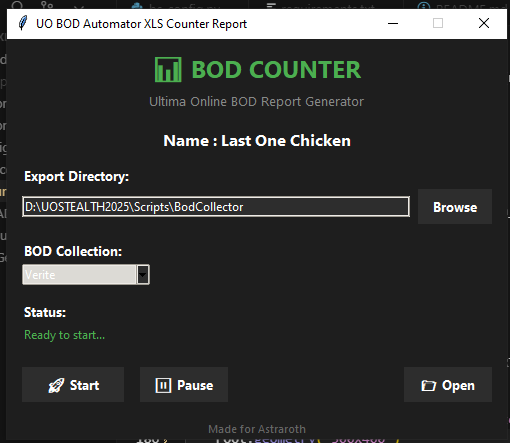

# BODs XLS Export



Sistema automatizado para contagem e exportação de BODs (Bulk Order Deeds) do Ultima Online para planilhas Excel.

## 📋 Funcionalidades

- **Interface gráfica moderna** com tema escuro
- **Contagem automática** de BODs em sacolas no jogo
- **Exportação para Excel** com formatação colorida
- **Múltiplas coleções** (Verite, Agapite, Gold)
- **Seleção de diretório** de exportação personalizada
- **Status em tempo real** do processo
- **Botão para abrir** pasta de exportação
- **Validação de dados** e tratamento de erros

## 🚀 Como Usar

### Pré-requisitos

- **UO Stealth** instalado e configurado
- **Python 3.8+** (já incluído no UO Stealth)
- **Dependências Python** instaladas

### Instalação

1. **Clone ou baixe** este repositório
2. **Instale as dependências**:
   ```bash
   pip install -r requirements.txt
   ```
3. **Configure os IDs das sacolas** no arquivo `bs_config.py` (se necessário)

### Execução

1. **Abra o UO Stealth**
2. **Conecte-se ao servidor** Ultima Online
3. **Carregue o script** `countBodsGenXLS.py` no UO Stealth
4. **Clique em "Play"** para executar
5. **Configure o diretório** de exportação (se necessário)
6. **Selecione a coleção** de BODs desejada
7. **Clique em "Start"** para iniciar a contagem

### Configuração

- **Diretório de exportação**: Por padrão, os arquivos são salvos em `~/Documents/BOD_Reports/`
- **IDs das sacolas**: Configure no arquivo `bs_config.py` conforme suas sacolas no jogo
- **Coleções disponíveis**: Verite, Agapite, Gold

## 📁 Estrutura do Projeto

```
bodsxlsexport/
├── countBodsGenXLS.py    # Script principal com interface gráfica
├── xlsGenerator.py       # Gerador de planilhas Excel
├── bs_config.py          # Configurações e listas de BODs
├── modules/              # Módulos utilitários
│   ├── common_utils.py   # Funções utilitárias gerais
│   └── connection.py     # Utilitários de conexão
├── requirements.txt      # Dependências Python
├── README.md            # Documentação em inglês
├── README_PT.md         # Documentação em português
├── README_ES.md         # Documentação em espanhol
├── .gitignore           # Arquivos ignorados pelo Git
└── image.png            # Screenshot da interface
```

## 🔧 Solução de Problemas

### Script não inicia
- Verifique se o UO Stealth está funcionando
- Confirme se o Python está configurado corretamente
- Verifique se todas as dependências estão instaladas

### Nenhum BOD encontrado
- Certifique-se de que as sacolas estão no chão próximo ao personagem
- Verifique se os IDs das sacolas em `bs_config.py` estão corretos
- Confirme se o personagem está próximo o suficiente das sacolas

### Erro ao salvar arquivo
- Verifique se o diretório de exportação existe
- Confirme se há permissões de escrita no diretório
- Tente selecionar um diretório diferente

## 📊 Formato da Planilha

A planilha Excel gerada contém:
- **Colunas por material e quantidade** (ex: "VERITE 20e", "AGAPITE 15e")
- **Linhas por tipo de item** (LBOD, COIF, LEGS, TUNIC, etc.)
- **Cores diferenciadas** por material:
  - 🔵 Azul: Valorite
  - 🟢 Verde: Verite
  - 🟣 Roxo: Agapite
  - 🟡 Amarelo: Gold
  - 🔴 Vermelho: Valores zerados

## 🎮 Compatibilidade

- **Servidor**: Astraroth (Ultima Online)
- **Cliente**: UO Stealth
- **Sistemas**: Windows, macOS, Linux

## 📝 Changelog

### v1.1.0
- ✨ Interface gráfica moderna com tema escuro
- ✨ Seleção de diretório de exportação
- ✨ Status em tempo real
- ✨ Botão para abrir pasta de exportação
- ✨ Validação de dados aprimorada
- ✨ Tratamento de erros melhorado
- ✨ Interface mais compacta e responsiva

### v1.0.0
- 🎉 Versão inicial
- ✨ Contagem automática de BODs
- ✨ Exportação para Excel
- ✨ Múltiplas coleções de BODs

## 👨‍💻 Autor

**Feito para Astraroth** - Servidor Ultima Online

## 📄 Licença

Este projeto é de uso livre para a comunidade do Ultima Online.

---

*Para suporte ou dúvidas, entre em contato através dos canais oficiais do servidor Astraroth.*
